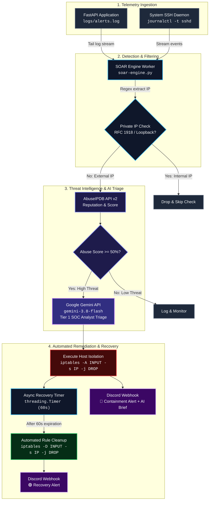

# Lightweight Python SOAR Engine (SecOps)

The early stages of a lightweight Security Orchestration, Automation, and Response (SOAR) pipeline built in Python. Designed for rapid threat detection, automated threat intelligence enrichment, and host-level containment with minimal system overhead.

## Architecture & Workflow

1. **Ingestion:** FastAPI endpoint simulates an exposed web application logging client login attempts (`alerts.log`). Also monitors host-level SSH authentication events continuously via `journalctl -t sshd`.
2. **Parsing & Triage:** Python worker continuously tails the log streams and extracts client IP addresses using regex.
3. **Enrichment:** Queries the **AbuseIPDB API** to check the global reputation score and report history of external IPs.
4. **Automated Response:** If the threat score exceeds the defined threshold (e.g. 50%), the engine automatically executes an OS-level `iptables` DROP rule to isolate the host. An async timer (`threading.Timer`) with a defined threshold in seconds (e.g 300) removes the block rule (`iptables -D`) after said time. A discord webhook fires alerts on threath mitigation and recovery.

  

## Tech Stack
* **Language:** Python 3.12
* **Web Framework:** FastAPI / Uvicorn
* **Threat Intel:** AbuseIPDB v2 REST API
* **System Containment:** Linux `iptables` / Subprocess Orchestration

### Prerequisites
* Linux OS (Tested on Fedora)
* Python 3.10+
* `sudo` privileges for `iptables` rules

